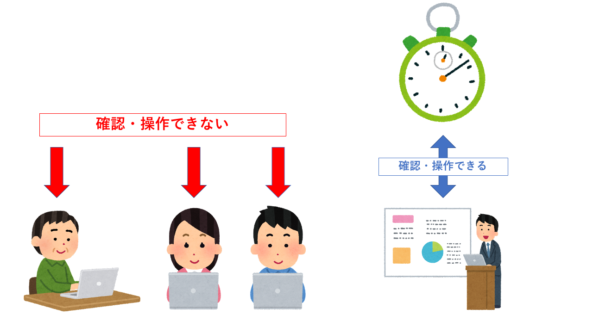
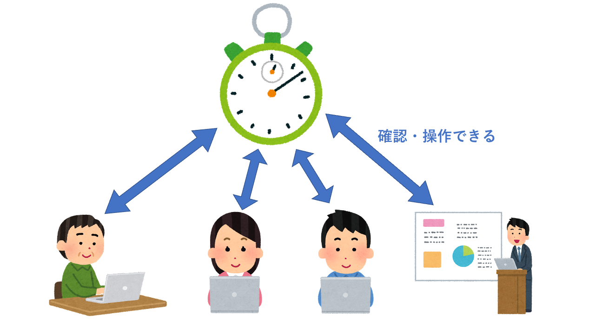

# システムの目的

## Zoom を用いたオンライン MT において、OBS を使用した発表時間のタイマー管理を脱却したい

クライアントはミーティングの際に発表者に発表時間を守らせるためタイムキーパーを設置し時間の管理を行っている．

現状タイムキーパー役はタイマーアプリを起動し，zoom の画面共有機能を用いずにタイマーを発表者の内容を聞きながらスタートストップの操作を行う必要があるため手間である．

またタイムキーパーが管理するストップウォッチを zoom カメラを用いて表示していたが，発表者が発表中にタイマー画面を確認することは難しいため残り時間の告知が必要とされるが，タイムキーパーが発表中に声をだして割り込むことには抵抗がある．

MT メンバーが一つのタイマーを共有で操作できる web アプリを実装し発表者がスタートストップの操作を行うことで，タイムキーパーが発表内容に合わせてタイマーを操作する手間を解消するとともに，残り時間の通知機能を実装することで発表者が残り時間を把握しやすくなる．

# 要求するシステムの概要

ブラウザ上で実行できるタイマーアプリ。

タイマーの進捗は web アプリにアクセスした全員で同期されており、全員が確認可能である。

自分の発表順が回ってきたら、ブラウザ上で自らタイマーをスタートさせる。

持ち時間が終了したら、システムが音などを出して既定の時間内で発表を終了させるように促す。

終了時は発表者がタイマーをストップし、リセットする。そして次の人に順番を渡す。

発表時間や発表の順番は適宜カスタマイズ可能。

## 現状

- タイマー係がタイマーを操作
- OBS を用いて共有するため，操作が複雑＆処理が重くなる
- タイマー係が声を発して終了を知らせる必要がある
  

## システム導入後

- タイマー係が必要なくなる
- 各自のブラウザから発表時間の終了を知らせる
  

# 要求機能一覧

## (1)タイマ機能

スタート、ストップにより経過時間を表示するタイマー.

再度スタートを押すと途中から.

リセットにより０から.

利用者全員が一つのタイマーを見る.

## (2)制限時間アナウンス機能

予め設定した制限時間が近づいたタイミングと，制限時間が経過したタイミングで通知音がなる機能．

制限時間が近づいたタイミングは任意で設定可能（30 秒前，10 秒前など）．

# 稼働開始時期

- 2Q 終了時

# 想定予算

# 調整が必要な関連部署

- ミーティング参加メンバーは共有タイマーにアクセスし、自身の発表前後に操作を行う必要がある
