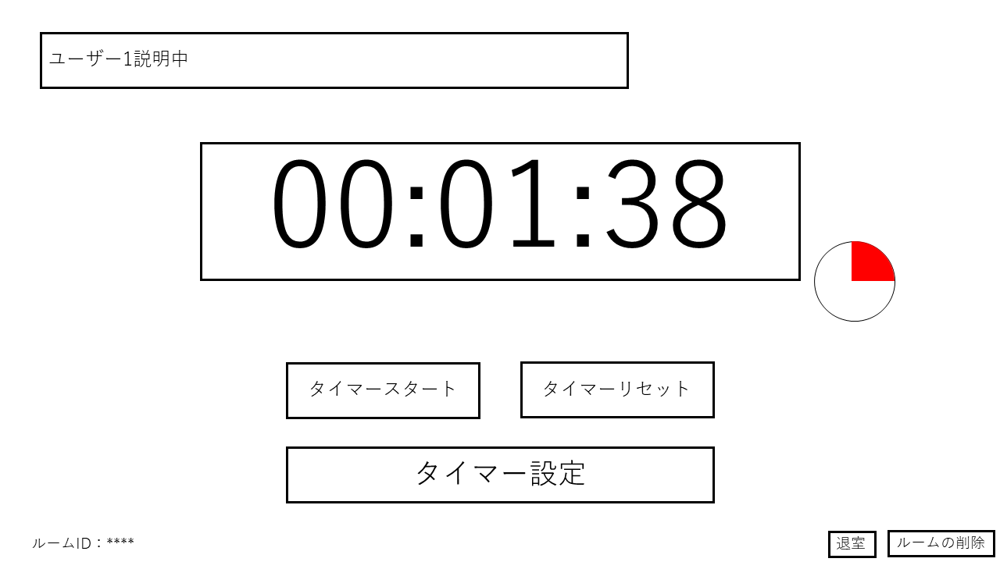

# ユースケース ８： タイマーをストップする

## 概要
ユーザがタイマーのストップボタンを押し、タイマーが停止する．

## アクター
- ユーザ

## 事前条件
- タイマーが動いていること.
- ルーム画面が表示されていること.

## 事後条件
- 共有タイマーが停止する.

## トリガ―
- ユーザがタイマーの停止ボタンを押す.

## 基本フロー
1. システムは，タイマーを表示する．
2. ユーザは，タイマーのストップを押す．
3. システムは，タイマーをストップする．

## 代替フロー
- 3.a.1  基本フロー3において，タイマーが稼働していない場合,システムはエラーを出し１に戻る.

## GUI紙芝居
### ルーム画面

コメント：事前画面・タイマー稼働中.画像のタイマースタートがタイマーストップにかわっているはず。

### ルーム画面

コメント：事後画面・タイマー停止
