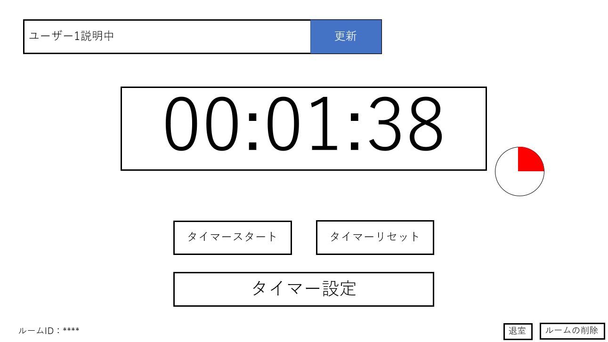

# ユースケース 9： 「現在の状態の編集」

## 概要
ユーザが現在の状態に関するコメントを入力し、ルームに表示する．

## アクター
- ユーザ

## 事前条件
- ルーム画面が表示されていること.

## 事後条件
- ルーム画面の現在の状態が入力した内容に更新される.

## トリガ―
- ユーザが現在の状態のテキストボックスを編集し更新ボタンを押す.

## 基本フロー
1. システムは，ルーム画面表示する．
2. ユーザは，現在の状態のテキストボックスを編集し更新ボタンを押す．
3. システムは，ルーム画面の現在の状態の表示内容を更新する．

## 代替フロー
- システムはエラーを出し１に戻る.

## GUI紙芝居
### ルーム画面

コメント：ルーム画面,「ユーザ１説明中」と表示されている.

