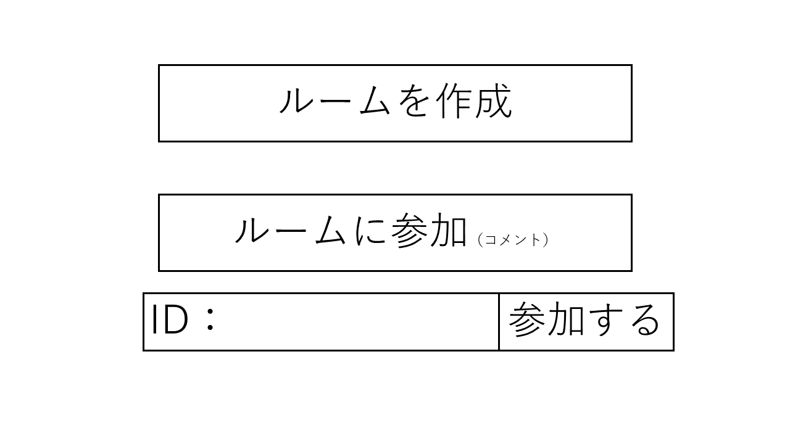

# ユースケース 3： ルームを削除する

## 概要
ルームに参加しているメンバーがボタンにおいて，現在参加しているルームを削除する

## アクター
- ユーザー

## 事前条件
- ユーザがルームに参加していること

## 事後条件
- ルームが削除されシステム上でルームに占有されていた資源が解放される．
- ルームに参加していたメンバー全員がフロントに戻される．

## トリガ―
- ルームに参加しているユーザー(任意)がルーム削除ボタンを押す．

## 基本フロー
1. ユーザーは，ルーム削除ボタンをクリックする．
2. システムは，確認コメントと実行，キャンセルボタンを表示する．
3. ユーザーは，実行ボタンを押す．
4. システムは，ルームに参加していたユーザー全員をロービー画面に戻す．
5. システムは，ルームを削除し占有していた資源を開放する．

## 代替フロー
### 代替フロー1
- 2.a.1  ユーザーが確認中にキャンセルボタンを押す．
- 2.a.2  システムは，ユーザーに表示された確認コメントとボタンを消す．

## GUI紙芝居
### ルーム画面

コメント：．．．

### 確認画面

### ロビー画面

コメント：．．．

