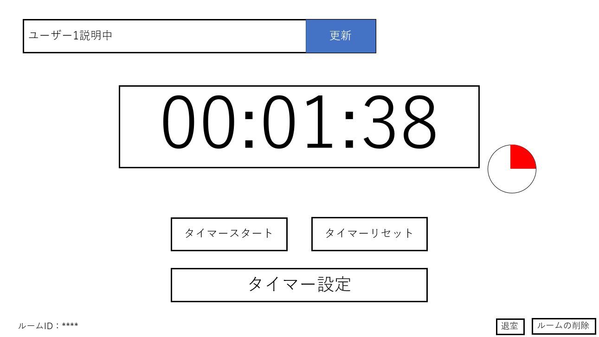

# ユースケース 07： タイマーをリセットする

## 概要
ユーザーがタイマーをリセットする

## アクター
- ユーザー

## 事前条件
- ユーザーがルーム画面を表示していること
- ルーム内のタイマーがカウント中、もしくは停止していること

## 事後条件
- ルーム内に存在するタイマーのカウントが0になる

## トリガ―
- ユーザーがルーム画面でタイマーの「リセット」ボタンを押す

## 基本フロー
1. ユーザーは，ルーム画面で「リセット」ボタンを押す。
2. システムは，ルームに紐づいたタイマーのカウントを0にセットする

## 代替フロー
### 代替フロー1

## GUI紙芝居
### ルーム画面

